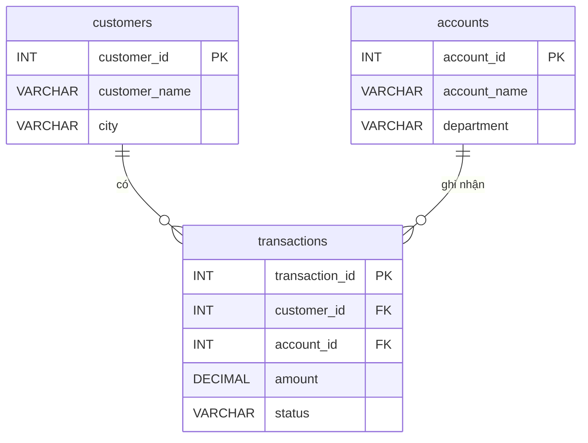

# Tự học SQL với MySQL trong 7 ngày

Đây là tài liệu **để tự đọc và tự học**, dùng song song với [`bai-tap.md`](bai-tap.md). Mỗi ngày gồm khái niệm, cú pháp, ví dụ, cách tư duy, lỗi thường gặp và ứng dụng trong thống kê, kiểm toán hoặc phân tích dữ liệu.

Mục tiêu sau 7 ngày: bạn có thể dùng SQL để đọc dữ liệu, lọc dữ liệu, nối bảng, tổng hợp, kiểm tra chất lượng dữ liệu, phát hiện bất thường và viết các truy vấn phân tích ở mức đủ tốt để bắt đầu làm việc với dữ liệu thực tế.

## 0. Chuẩn bị trước khi học

### Công cụ nên cài

- MySQL Community Server.
- MySQL Workbench hoặc DBeaver.
- Một database mẫu như `sakila`, `world`, `employees`, hoặc tự tạo bộ bảng `customers`, `accounts`, `transactions`.

### Bộ bảng dùng xuyên suốt tài liệu

Dưới đây là sơ đồ quan hệ (ERD) giữa 3 bảng để bạn dễ hình dung cách chúng liên kết với nhau:



Trong phần lý thuyết và bài tập, ta giả định có 3 bảng:

```sql
customers(
    customer_id INT,
    customer_name VARCHAR(100),
    city VARCHAR(100),
    segment VARCHAR(50),
    created_at DATE
)

accounts(
    account_id INT,
    account_name VARCHAR(100),
    department VARCHAR(100)
)

transactions(
    transaction_id INT,
    customer_id INT,
    account_id INT,
    transaction_date DATE,
    amount DECIMAL(15, 2),
    status VARCHAR(30)
)
```

Ý nghĩa nghiệp vụ:

- `customers`: danh sách khách hàng.
- `accounts`: tài khoản, phòng ban, nhóm sản phẩm hoặc nhóm nghiệp vụ.
- `transactions`: giao dịch phát sinh.

Các trạng thái giao dịch:

- `approved`: đã duyệt, thường dùng để tính doanh thu chính thức.
- `pending`: chờ xử lý.
- `cancelled`: đã hủy.
- `review`: cần kiểm tra thêm.

### Cách dùng tài liệu để nhớ lâu

1. **Đọc để hiểu:** trước mỗi query, đoán bảng kết quả sẽ có những cột và dòng nào.
2. **Gõ để nhớ:** tự gõ lại query, không sao chép; đổi ít nhất một điều kiện rồi chạy lại.
3. **Nói để kiểm tra:** giải thích query theo thứ tự xử lý dữ liệu, bắt đầu từ `FROM`, không đọc máy móc từ `SELECT`.
4. **Làm để vận dụng:** đóng tài liệu và giải bài tương ứng trong [`bai-tap.md`](bai-tap.md).
5. **Ôn chủ động:** trả lời phần “Tự kiểm tra” mà không nhìn lại nội dung. Nếu chưa trả lời được, đánh dấu và ôn lại vào ngày hôm sau.

> **Công thức đọc một query:** Nguồn nào? → Nối thế nào? → Giữ dòng nào? → Gom nhóm ra sao? → Giữ nhóm nào? → Hiển thị gì? → Sắp xếp và giới hạn thế nào?

### Bản đồ 7 ngày

| Ngày | Câu hỏi chính | Công cụ |
|---|---|---|
| 1 | Lấy dòng và cột nào? | `SELECT`, `WHERE`, `ORDER BY`, `LIMIT` |
| 2 | Lọc đúng kiểu dữ liệu và dữ liệu thiếu thế nào? | `AND`, `OR`, `IN`, `LIKE`, `IS NULL`, `COALESCE` |
| 3 | Biến dữ liệu chi tiết thành báo cáo thế nào? | `COUNT`, `SUM`, `AVG`, `GROUP BY`, `HAVING` |
| 4 | Ghép nhiều bảng mà không mất hoặc nhân sai dòng thế nào? | `INNER JOIN`, `LEFT JOIN` |
| 5 | Chia một bài toán dài thành các bước thế nào? | Subquery, CTE (`WITH`) |
| 6 | Tính theo nhóm nhưng vẫn giữ từng dòng thế nào? | Window functions |
| 7 | Kiểm tra dữ liệu và sửa dữ liệu an toàn thế nào? | Data quality, `INSERT`, `UPDATE`, `DELETE` |

---

## Ngày 1: Nền tảng SQL và truy vấn dữ liệu cơ bản

### 1.1. SQL là gì?

> 💡 **Hãy tưởng tượng:** Database giống như một Thư viện khổng lồ với hàng triệu cuốn sách (dữ liệu). Bạn không thể tự mình xông vào và bới tung các kệ sách lên được. Bạn cần nói chuyện với "người Thủ thư". SQL chính là ngôn ngữ bạn dùng để ra lệnh cho người Thủ thư đó tìm đúng cuốn sách bạn cần.

SQL là ngôn ngữ dùng để làm việc với dữ liệu trong cơ sở dữ liệu quan hệ. Dữ liệu quan hệ nghĩa là dữ liệu được lưu thành các bảng, các bảng có thể liên kết với nhau qua khóa.

Trong công việc thống kê, kiểm toán hoặc phân tích dữ liệu, SQL thường dùng để:

- Lấy dữ liệu từ hệ thống.
- Lọc dữ liệu theo kỳ, khách hàng, trạng thái hoặc điều kiện nghiệp vụ.
- Tổng hợp số liệu.
- Đối chiếu dữ liệu chi tiết với báo cáo tổng.
- Phát hiện dữ liệu thiếu, sai, trùng hoặc bất thường.

### 1.2. Database, table, row, column

Một database giống như một tủ hồ sơ. Trong đó có nhiều bảng.

Một bảng giống như một sheet Excel có cấu trúc rõ ràng:

- `column`: cột, ví dụ `customer_id`, `amount`, `status`.
- `row`: dòng, ví dụ một khách hàng hoặc một giao dịch.
- `table`: bảng, ví dụ `transactions`.
- `database`: nơi chứa nhiều bảng.

Ví dụ bảng `transactions`:

| transaction_id | customer_id | transaction_date | amount | status |
|---|---:|---|---:|---|
| 1 | 101 | 2026-01-01 | 1500000 | approved |
| 2 | 102 | 2026-01-02 | 300000 | review |

Mỗi dòng là một giao dịch. Mỗi cột mô tả một thuộc tính của giao dịch đó.

### 1.3. Câu lệnh SELECT

`SELECT` dùng để lấy dữ liệu.

Cú pháp cơ bản:

```sql
SELECT column_1, column_2
FROM table_name;
```

Ví dụ:

```sql
SELECT customer_id, customer_name, city
FROM customers;
```

Query này có nghĩa là: từ bảng `customers`, lấy 3 cột `customer_id`, `customer_name`, `city`.

### 1.4. SELECT *

```sql
SELECT *
FROM customers;
```

Dấu `*` nghĩa là lấy tất cả cột.

Khi học, `SELECT *` giúp xem nhanh dữ liệu. Khi đi làm, không nên lạm dụng vì:

- Kết quả có thể quá nhiều cột.
- Query nặng hơn.
- Báo cáo khó đọc.
- Dễ lấy cả dữ liệu nhạy cảm không cần thiết.

### 1.5. WHERE để lọc dòng

`WHERE` dùng để lọc các dòng thỏa điều kiện.

```sql
SELECT *
FROM transactions
WHERE amount > 1000000;
```

Query này lấy các giao dịch có số tiền lớn hơn 1.000.000.

Ví dụ lọc theo trạng thái:

```sql
SELECT transaction_id, transaction_date, amount
FROM transactions
WHERE status = 'approved';
```

Trong SQL, chuỗi văn bản nên đặt trong dấu nháy đơn `'...'`. Đừng dựa vào dấu nháy kép vì cách MySQL hiểu nó có thể thay đổi theo SQL mode.

### 1.6. ORDER BY để sắp xếp

```sql
SELECT *
FROM transactions
ORDER BY amount DESC;
```

- `ASC`: tăng dần.
- `DESC`: giảm dần.

Ví dụ lấy giao dịch lớn nhất trước:

```sql
SELECT transaction_id, customer_id, amount
FROM transactions
ORDER BY amount DESC;
```

### 1.7. LIMIT để giới hạn số dòng

```sql
SELECT *
FROM transactions
LIMIT 10;
```

`LIMIT` rất hữu ích khi xem thử dữ liệu lớn. Thay vì tải cả triệu dòng, bạn chỉ xem 10 dòng đầu.

Kết hợp sắp xếp và giới hạn:

```sql
SELECT transaction_id, customer_id, amount
FROM transactions
ORDER BY amount DESC

### 1.6. ORDER BY để sắp xếp

```sql
SELECT *
FROM transactions
ORDER BY amount DESC;
```

- `ASC`: tăng dần.
- `DESC`: giảm dần.

Ví dụ lấy giao dịch lớn nhất trước:

```sql
SELECT transaction_id, customer_id, amount
FROM transactions
ORDER BY amount DESC;
```

### 1.7. LIMIT để giới hạn số dòng

```sql
SELECT *
FROM transactions
LIMIT 10;
```

`LIMIT` rất hữu ích khi xem thử dữ liệu lớn. Thay vì tải cả triệu dòng, bạn chỉ xem 10 dòng đầu.

Kết hợp sắp xếp và giới hạn:

```sql
SELECT transaction_id, customer_id, amount
FROM transactions
ORDER BY amount DESC
LIMIT 5;
```

Query này lấy 5 giao dịch có số tiền cao nhất.

### 1.8. Thứ tự viết và thứ tự hiểu query

> 💡 **Hãy tưởng tượng:** Bạn là một Bếp trưởng. Quy trình làm món ăn luôn có thứ tự: (1) Xuống kho lấy nguyên liệu (`FROM`), (2) Nhặt bỏ củ hỏng (`WHERE`), (3) Chia khoai vào từng rổ (`GROUP BY`), (4) Bỏ những rổ quá ít (`HAVING`), (5) Xếp thức ăn lên đĩa và đặt tên món (`SELECT` + `AS`), (6) Bưng ra bàn (`ORDER BY`).
> 
> Vì "Nhặt lá sâu" (`WHERE`) diễn ra **TRƯỚC** khi "Đặt tên món" (`SELECT AS`), nên bạn không thể dùng tên món ăn để nhặt lá sâu! Đó là lý do SQL báo lỗi nếu bạn cố dùng Alias trong mệnh đề `WHERE`.

Thứ tự viết thường là:

```sql
SELECT ...
FROM ...
WHERE ...
ORDER BY ...
LIMIT ...
```

Nhưng thứ tự xử lý logic đầy đủ nên được ghi nhớ như sau:

1. `FROM` / `JOIN`: lấy và nối nguồn dữ liệu.
2. `WHERE`: lọc từng dòng.
3. `GROUP BY`: gom các dòng thành nhóm.
4. `HAVING`: lọc từng nhóm.
5. `SELECT`: tính và chọn cột trả về.
6. `ORDER BY`: sắp xếp kết quả.
7. `LIMIT`: giới hạn số dòng trả về.

> **Mẹo nhớ:** **Nguồn → Dòng → Nhóm → Lọc nhóm → Cột → Xếp → Giới hạn**.

### 1.9. Ứng dụng trong thống kê và kiểm toán

Bạn có thể dùng kiến thức ngày 1 để:

- Xem mẫu dữ liệu trước khi phân tích.
- Lọc giao dịch có giá trị lớn.
- Lấy danh sách giao dịch đã duyệt.
- Lấy top giao dịch theo số tiền.
- Kiểm tra nhanh dữ liệu có đúng cột cần dùng không.

### 1.10. Lỗi thường gặp

- Quên dấu phẩy giữa các cột.
- Quên dấu chấm phẩy khi chạy nhiều câu lệnh trong cùng một script. Với một câu lệnh đơn, nhiều công cụ vẫn chạy được dù thiếu dấu này, nhưng nên giữ thói quen viết `;`.
- Nhầm tên bảng hoặc tên cột.
- Dùng nháy kép thay vì nháy đơn cho chuỗi.
- Lạm dụng `SELECT *`.

### 1.11. Tự kiểm tra

Không nhìn lại nội dung, hãy trả lời:

1. `WHERE` loại bỏ dòng ở giai đoạn nào?
2. Muốn lấy 5 giao dịch lớn nhất, ba mệnh đề cuối query là gì?
3. Vì sao không nên dùng `SELECT *` trong báo cáo thật?

---

## Ngày 2: Kiểu dữ liệu, điều kiện lọc và xử lý NULL

### 2.1. Vì sao cần hiểu kiểu dữ liệu?

SQL không chỉ là lấy dữ liệu. Bạn cần hiểu dữ liệu thuộc loại gì để lọc, tính toán và so sánh đúng.

Ví dụ:

- `amount` là số tiền, nên dùng kiểu số.
- `transaction_date` là ngày, nên dùng kiểu ngày.
- `status` là chuỗi, nên so sánh bằng chuỗi.

Nếu kiểu dữ liệu sai, kết quả phân tích có thể sai dù query vẫn chạy.

### 2.2. Kiểu dữ liệu phổ biến trong MySQL

Kiểu số:

- `INT`: số nguyên, thường dùng cho ID hoặc số lượng.
- `DECIMAL(15, 2)`: số thập phân chính xác, nên dùng cho tiền.
- `FLOAT`, `DOUBLE`: số thực xấp xỉ, phù hợp cho đo lường, không lý tưởng cho tiền.

Kiểu chuỗi:

- `VARCHAR(n)`: chuỗi có độ dài thay đổi.
- `CHAR(n)`: chuỗi có độ dài cố định.
- `TEXT`: chuỗi dài.

Kiểu ngày giờ:

- `DATE`: chỉ có ngày, ví dụ `2026-01-31`.
- `DATETIME`: có cả ngày và giờ.
- `TIMESTAMP`: có ngày giờ và thường liên quan đến múi giờ/hệ thống.

### 2.3. Các toán tử điều kiện

So sánh số:

```sql
SELECT *
FROM transactions
WHERE amount >= 1000000;
```

So sánh chuỗi:

```sql
SELECT *
FROM transactions
WHERE status = 'approved';
```

Khác giá trị:

```sql
SELECT *
FROM transactions
WHERE status <> 'cancelled';
```

Nằm trong danh sách:

```sql
SELECT *
FROM transactions
WHERE status IN ('pending', 'review');
```

Tìm theo mẫu:

```sql
SELECT *
FROM customers
WHERE customer_name LIKE 'Nguyễn%';
```

Trong đó:

- `%` đại diện cho nhiều ký tự bất kỳ.
- `_` đại diện cho một ký tự bất kỳ.

### 2.4. Lọc ngày tháng đúng cách

Cách nên dùng khi lọc một tháng:

```sql
SELECT *
FROM transactions
WHERE transaction_date >= '2026-01-01'
  AND transaction_date < '2026-02-01';
```

Cách này tốt hơn:

```sql
WHERE transaction_date BETWEEN '2026-01-01' AND '2026-01-31'
```

Lý do: nếu cột là `DATETIME`, dữ liệu ngày `2026-01-31 14:30:00` có thể bị sót nếu bạn viết điều kiện không cẩn thận.

### 2.5. AND, OR và dấu ngoặc

`AND` nghĩa là cả hai điều kiện cùng đúng.

```sql
SELECT *
FROM transactions
WHERE amount > 1000000
  AND status = 'approved';
```

`OR` nghĩa là một trong hai điều kiện đúng.

```sql
SELECT *
FROM transactions
WHERE status = 'pending'
   OR status = 'review';
```

Khi có cả `AND` và `OR`, nên dùng dấu ngoặc để tránh hiểu sai:

```sql
SELECT *
FROM transactions
WHERE status = 'approved'
  AND (amount < 0 OR amount > 100000000);
```

Query này lấy giao dịch đã duyệt nhưng có số tiền âm hoặc quá lớn.

### 2.6. NULL là gì?

> 💡 **Hãy tưởng tượng:** Số `0` nghĩa là bạn mở ví ra và thấy có 0 đồng (bạn biết rõ số lượng là 0). `NULL` nghĩa là bạn thậm chí còn không mang theo ví, hoặc cái ví bị tàng hình. Bạn không thể mang một cái ví tàng hình (`NULL`) đi cộng trừ nhân chia được.

`NULL` nghĩa là chưa có giá trị, không rõ giá trị hoặc không áp dụng.

`NULL` khác với:

- `0`: có giá trị bằng 0.
- `''`: chuỗi rỗng.
- `'NULL'`: chữ NULL dạng văn bản.

Kiểm tra `NULL` phải dùng:

```sql
WHERE amount IS NULL
```

Không dùng:

```sql
WHERE amount = NULL
```

### 2.7. Xử lý NULL bằng COALESCE

```sql
SELECT transaction_id,
       amount,
       COALESCE(amount, 0) AS amount_clean
FROM transactions;
```

If `amount` là `NULL`, cột `amount_clean` sẽ là 0. Nếu `amount` có giá trị, giữ nguyên giá trị đó.

Lưu ý: thay `NULL` bằng 0 không phải lúc nào cũng đúng. Trong phân tích, `NULL` có thể nghĩa là dữ liệu thiếu, còn 0 có thể nghĩa là giao dịch không phát sinh tiền. Hai ý nghĩa này khác nhau.

### 2.8. Ứng dụng trong thống kê và kiểm toán

Bạn có thể dùng kiến thức ngày 2 để:

- Lọc giao dịch trong kỳ kiểm toán.
- Tìm số tiền bị thiếu.
- Tìm giao dịch âm.
- Tìm giao dịch ở trạng thái cần kiểm tra.
- Kiểm tra dữ liệu đầu vào trước khi tính tổng hoặc trung bình.

### 2.9. Lỗi thường gặp

- Dùng `= NULL`.
- Không dùng dấu ngoặc khi kết hợp `AND` và `OR`.
- Lọc tháng bằng cách dễ sót dữ liệu có giờ.
- Không phân biệt `NULL` với 0.
- Dùng kiểu `FLOAT` cho dữ liệu tiền.

### 2.10. Tự kiểm tra

1. Vì sao `amount = NULL` không tìm được dữ liệu thiếu?
2. `NULL`, `0` và chuỗi rỗng khác nhau thế nào?
3. Vì sao lọc theo khoảng nửa mở `>= ngày đầu` và `< ngày đầu tháng sau` an toàn cho cả `DATE` lẫn `DATETIME`?

---

## Ngày 3: Tổng hợp dữ liệu với GROUP BY

### 3.1. Vì sao cần tổng hợp dữ liệu?

Dữ liệu thực tế thường ở mức chi tiết: mỗi dòng là một giao dịch. Nhưng báo cáo thường cần mức tổng hợp:

- Tổng doanh thu theo tháng.
- Số giao dịch theo trạng thái.
- Tổng tiền theo khách hàng.
- Trung bình giao dịch theo phòng ban.

SQL giải quyết việc này bằng hàm tổng hợp và `GROUP BY`.

### 3.2. Các hàm tổng hợp quan trọng

Đếm số dòng:

```sql
SELECT COUNT(*) AS total_rows
FROM transactions;
```

Đếm số giá trị không thiếu trong một cột:

```sql
SELECT COUNT(amount) AS count_amount_not_null
FROM transactions;
```

Tính tổng:

```sql
SELECT SUM(amount) AS total_amount
FROM transactions;
```

Tính trung bình:

```sql
SELECT AVG(amount) AS avg_amount
FROM transactions;
```

Tìm nhỏ nhất và lớn nhất:

```sql
SELECT MIN(amount) AS min_amount,
       MAX(amount) AS max_amount
FROM transactions;
```

### 3.3. COUNT(*) và COUNT(column)

`COUNT(*)` đếm số dòng.

`COUNT(column)` chỉ đếm các dòng mà `column` không `NULL`.

Ví dụ nếu có 100 giao dịch nhưng 5 giao dịch thiếu `amount`:

- `COUNT(*)` = 100.
- `COUNT(amount)` = 95.

Điểm này rất quan trọng khi kiểm tra tính đầy đủ của dữ liệu.

### 3.4. GROUP BY

> 💡 **Hãy tưởng tượng:** Bạn có một đống tiền lẻ lộn xộn trên bàn. `GROUP BY mệnh_giá` chính là hành động dùng tay gom tiền thành các cọc 10k, 20k, 50k. Hàm `COUNT()` là hành động đếm xem cọc 50k có mấy tờ. `SUM()` là hành động tính tổng tiền của cọc 50k đó. Bạn bắt buộc phải chia cọc (GROUP BY) thì mới đếm và tính tổng cho từng cọc được.

Để dễ hình dung `GROUP BY` hoạt động như thế nào, hãy xem ví dụ gom nhóm sau đây:

**Dữ liệu gốc:**
| id | status | amount |
|---|---|---|
| 1 | approved | 100 |
| 2 | pending | 50 |
| 3 | approved | 200 |

**Sau khi GROUP BY status và đếm số lượng (COUNT):**
| status | transaction_count |
|---|---|
| approved | 2 |
| pending | 1 |

Tính số giao dịch theo trạng thái:

```sql
SELECT status,
       COUNT(*) AS transaction_count
FROM transactions
GROUP BY status;
```

Tính tổng tiền theo khách hàng:

```sql
SELECT customer_id,
       SUM(amount) AS total_amount
FROM transactions
GROUP BY customer_id;
```

Tính báo cáo theo tháng:

```sql
SELECT DATE_FORMAT(transaction_date, '%Y-%m') AS month,
       SUM(amount) AS monthly_amount
FROM transactions
GROUP BY DATE_FORMAT(transaction_date, '%Y-%m')
ORDER BY month;
```

### 3.5. WHERE và HAVING khác nhau thế nào?

`WHERE` lọc dữ liệu trước khi tổng hợp.

```sql
SELECT customer_id,
       SUM(amount) AS total_approved_amount
FROM transactions
WHERE status = 'approved'
GROUP BY customer_id;
```

Query này chỉ lấy giao dịch approved trước, rồi mới tính tổng theo khách hàng.

`HAVING` lọc sau khi đã tổng hợp.

```sql
SELECT customer_id,
       SUM(amount) AS total_approved_amount
FROM transactions
WHERE status = 'approved'
GROUP BY customer_id
HAVING SUM(amount) > 10000000;
```

Query này tìm khách hàng có tổng giao dịch approved trên 10 triệu.

### 3.6. Alias là gì?

Alias là tên tạm đặt cho cột hoặc bảng.

```sql
SELECT SUM(amount) AS total_amount
FROM transactions;
```

`AS total_amount` giúp kết quả dễ đọc hơn. Khi viết báo cáo, nên đặt alias rõ nghĩa.

### 3.7. Ứng dụng trong thống kê và kiểm toán

Bạn có thể dùng `GROUP BY` để:

- Lập bảng thống kê mô tả.
- Tính tổng phát sinh theo tháng.
- Tính số giao dịch theo trạng thái.
- Tìm khách hàng có tổng giao dịch cao.
- Đối chiếu số liệu chi tiết với số liệu tổng.
- Phát hiện nhóm bất thường: phòng ban có tổng tiền quá lớn, trạng thái review tăng đột biến.

### 3.8. Lỗi thường gặp

- Đưa cột không tổng hợp vào `SELECT` nhưng không đưa vào `GROUP BY`.
- Dùng `WHERE SUM(amount) > ...` thay vì `HAVING`.
- Quên lọc trạng thái trước khi tính doanh thu.
- Không kiểm tra dữ liệu âm hoặc `NULL` trước khi tính tổng.

### 3.9. Tự kiểm tra

1. `COUNT(*)` khác `COUNT(amount)` ở điểm nào?
2. `WHERE` và `HAVING` lọc ở hai thời điểm nào?
3. Nếu muốn một dòng cho mỗi khách hàng, cột nào phải có trong `GROUP BY`?

---

## Ngày 4: JOIN và mô hình dữ liệu quan hệ

### 4.1. Vì sao dữ liệu được tách thành nhiều bảng?

> 💡 **Hãy tưởng tượng:** Bạn là một thám tử. Trên tay trái là danh sách "Mã khách hàng" có dấu hiệu đáng ngờ. Trên tay phải là cuốn danh bạ lưu thông tin cá nhân của toàn dân. Bạn không thể chép nguyên cuốn danh bạ vào danh sách đáng ngờ vì nó quá dài và trùng lặp. Thay vào đó, bạn chỉ cần dùng "Mã khách hàng" để dò (JOIN) sang cuốn danh bạ mỗi khi cần biết tên tuổi của họ.

Trong thực tế, dữ liệu không nên nhồi hết vào một bảng lớn. Ví dụ, nếu mỗi giao dịch đều lặp lại tên khách hàng, thành phố, phân khúc, phòng ban, tên tài khoản, dữ liệu sẽ bị trùng rất nhiều.

Database quan hệ tách dữ liệu thành nhiều bảng:

- Bảng danh mục: lưu thông tin tương đối ổn định, ví dụ `customers`, `accounts`.
- Bảng phát sinh: lưu giao dịch, ví dụ `transactions`.

Khi cần báo cáo đầy đủ, ta nối các bảng bằng `JOIN`.

### 4.2. Primary key và foreign key

`primary key` là khóa chính, dùng để định danh duy nhất một dòng.

Ví dụ:

- `customers.customer_id`
- `accounts.account_id`
- `transactions.transaction_id`

`foreign key` là khóa ngoại, dùng để liên kết sang bảng khác.

Ví dụ:

- `transactions.customer_id` liên kết với `customers.customer_id`.
- `transactions.account_id` liên kết với `accounts.account_id`.

### 4.3. INNER JOIN

`JOIN` dùng để ghép thông tin nằm ở nhiều bảng. Để hiểu cách ghép, hãy bắt đầu bằng hai bảng nhỏ:

**Bảng `customers`:**

| customer_id | customer_name |
|---:|---|
| 101 | An |
| 102 | Bình |
| 103 | Chi |

**Bảng `transactions`:**

| transaction_id | customer_id | amount |
|---:|---:|---:|
| 1 | 101 | 500000 |
| 2 | 101 | 300000 |
| 3 | 102 | 700000 |
| 4 | 999 | 200000 |

Điều kiện nối:

```sql
ON c.customer_id = t.customer_id
```

có nghĩa là: với mỗi dòng, MySQL so sánh `customer_id` của bảng `customers` với `customer_id` của bảng `transactions`. Hai dòng được ghép khi hai giá trị bằng nhau.

`INNER JOIN` chỉ trả về những cặp dòng tìm thấy giá trị khớp ở cả hai bảng:

```sql
SELECT c.customer_id,
       c.customer_name,
       t.transaction_id,
       t.amount
FROM customers AS c
JOIN transactions AS t
  ON c.customer_id = t.customer_id;
```

Kết quả:

| customer_id | customer_name | transaction_id | amount |
|---:|---|---:|---:|
| 101 | An | 1 | 500000 |
| 101 | An | 2 | 300000 |
| 102 | Bình | 3 | 700000 |

Quan sát kết quả:

- An xuất hiện hai lần vì khách hàng 101 có hai giao dịch. `JOIN` không bắt buộc mỗi dòng chỉ xuất hiện một lần.
- Chi không xuất hiện vì khách hàng 103 chưa có giao dịch khớp.
- Giao dịch 4 không xuất hiện vì không có khách hàng mang mã 999.

Có thể dùng biểu đồ Venn để nhớ nhanh rằng `INNER JOIN` chỉ giữ phần **có khớp**. Tuy nhiên, khi viết query, hãy nghĩ chính xác hơn: **SQL đang ghép từng cặp dòng thỏa điều kiện `ON`**.

> **Mẹo nhớ:** `INNER JOIN` = chỉ lấy dòng **ghép được**.

### 4.4. LEFT JOIN

`LEFT JOIN` cũng ghép dòng theo điều kiện `ON`, nhưng luôn giữ lại tất cả dòng của bảng viết bên trái. Nếu một dòng bên trái không tìm thấy dòng khớp bên phải, các cột lấy từ bảng bên phải nhận giá trị `NULL`.

> **Mẹo nhớ:** tên đứng bên trái `LEFT JOIN` là bảng được bảo toàn. Một dòng bên trái có thể sinh ra nhiều dòng kết quả nếu nó khớp nhiều dòng bên phải.

```sql
SELECT c.customer_id,
       c.customer_name,
       t.transaction_id,
       t.amount
FROM customers AS c
LEFT JOIN transactions AS t
  ON c.customer_id = t.customer_id;
```

Với dữ liệu mẫu phía trên, kết quả là:

| customer_id | customer_name | transaction_id | amount |
|---:|---|---:|---:|
| 101 | An | 1 | 500000 |
| 101 | An | 2 | 300000 |
| 102 | Bình | 3 | 700000 |
| 103 | Chi | NULL | NULL |

Chi vẫn xuất hiện vì `customers` là bảng bên trái. Do Chi chưa có giao dịch, `transaction_id` và `amount` nhận giá trị `NULL`.

Giao dịch mang `customer_id = 999` vẫn không xuất hiện vì query này bảo toàn bảng `customers`, không bảo toàn bảng `transactions`.

> **Mẹo nhớ:** `LEFT JOIN` = lấy **tất cả bên trái**, bên phải ghép được thì điền, không ghép được thì điền `NULL`.

### 4.5. Dùng LEFT JOIN để tìm dữ liệu thiếu

Tìm khách hàng chưa có giao dịch:

```sql
SELECT c.customer_id,
       c.customer_name
FROM customers AS c
LEFT JOIN transactions AS t
  ON c.customer_id = t.customer_id
WHERE t.transaction_id IS NULL;
```

Tìm giao dịch không có khách hàng hợp lệ:

```sql
SELECT t.transaction_id,
       t.customer_id,
       t.amount
FROM transactions AS t
LEFT JOIN customers AS c
  ON t.customer_id = c.customer_id
WHERE c.customer_id IS NULL;
```

Đây là dạng kiểm tra rất hữu ích trong kiểm toán dữ liệu.

### 4.6. Join nhiều bảng

```sql
SELECT c.customer_name,
       a.department,
       t.transaction_id,
       t.transaction_date,
       t.amount
FROM transactions AS t
JOIN customers AS c
  ON t.customer_id = c.customer_id
JOIN accounts AS a
  ON t.account_id = a.account_id;
```

Query này tạo dữ liệu giao dịch đầy đủ gồm tên khách hàng và phòng ban.

### 4.7. Cảnh báo: JOIN có thể làm sai tổng tiền

Nếu join vào một bảng mà khóa không duy nhất, một giao dịch có thể bị nhân thành nhiều dòng.

Ví dụ: nếu `accounts` có 2 dòng cùng `account_id = 10`, một giao dịch có `account_id = 10` sẽ bị lặp 2 lần sau join. Khi đó `SUM(amount)` sẽ bị sai.

Trước khi tổng hợp sau join, nên kiểm tra:

```sql
SELECT COUNT(*) AS row_count
FROM transactions;
```

Sau đó kiểm tra số dòng sau join:

```sql
SELECT COUNT(*) AS row_count_after_join
FROM transactions AS t
JOIN accounts AS a
  ON t.account_id = a.account_id;
```

Nếu số dòng tăng bất thường, cần kiểm tra khóa join.

### 4.8. Ứng dụng trong thống kê và kiểm toán

- Nối giao dịch với khách hàng để phân tích theo thành phố hoặc phân khúc.
- Nối giao dịch với tài khoản để phân tích theo phòng ban.
- Tìm dữ liệu không khớp giữa bảng phát sinh và bảng danh mục.
- Kiểm tra tính toàn vẹn tham chiếu.
- Chuẩn bị dữ liệu đầu vào cho dashboard.

### 4.9. Lỗi thường gặp

- Quên điều kiện `ON`.
- Join nhầm cột.
- Dùng `INNER JOIN` làm mất các dòng không khớp mà đáng ra cần kiểm tra.
- Tổng hợp sau join nhưng không kiểm tra nhân dòng.
- Đặt alias khó hiểu.

### 4.10. Tự kiểm tra

1. Bảng nào được bảo toàn trong `A LEFT JOIN B`?
2. Vì sao một dòng giao dịch có thể thành hai dòng sau `JOIN`?
3. Muốn tìm khách hàng chưa có giao dịch, vì sao dùng `LEFT JOIN` rồi kiểm tra khóa bên phải `IS NULL`?

---

## Ngày 5: Subquery, CTE và tư duy tách bài toán

### 5.1. Vì sao cần subquery và CTE?

> 💡 **Hãy tưởng tượng:** Trải nghiệm nấu một bữa ăn phức tạp. Nếu bạn ném thịt chưa thái, rau chưa rửa, gia vị chưa bóc vỏ vào chung một cái chảo khổng lồ (viết 1 query quá dài), món ăn sẽ hỏng bét. CTE giống như khâu "sơ chế": bạn thái thịt bỏ vào bát riêng, nhặt rau để rổ riêng, tính toán xong xuôi từng phần, rồi mới gộp tất cả lại ở bước cuối cùng.

Các câu hỏi thực tế thường không chỉ là "lấy dữ liệu". Chúng thường có nhiều bước.

Ví dụ:

- Tính tổng tiền theo khách hàng.
- Từ đó tìm khách hàng trên 10 triệu.
- Sau đó nối với thông tin khách hàng.
- Sau đó kiểm tra khách hàng đó có giao dịch review không.

Nếu viết tất cả trong một query dài, rất khó đọc và khó kiểm tra. Subquery và CTE giúp chia bài toán thành từng phần.

### 5.2. Subquery là gì?

Subquery là truy vấn nằm bên trong truy vấn khác.

Ví dụ: lấy giao dịch lớn hơn trung bình toàn bộ bảng.

```sql
SELECT *
FROM transactions
WHERE amount > (
    SELECT AVG(amount)
    FROM transactions
);
```

Phần bên trong:

```sql
SELECT AVG(amount)
FROM transactions
```

trả về một giá trị trung bình. Query bên ngoài dùng giá trị đó để lọc giao dịch.

### 5.3. Subquery với IN

Lấy khách hàng có ít nhất một giao dịch review:

```sql
SELECT *
FROM customers
WHERE customer_id IN (
    SELECT customer_id
    FROM transactions
    WHERE status = 'review'
);
```

Subquery trả về danh sách `customer_id`. Query ngoài lấy các khách hàng có ID nằm trong danh sách đó.

### 5.4. CTE là gì?

CTE viết tắt của Common Table Expression. Trong MySQL, CTE được viết bằng `WITH`.

```sql
WITH customer_total AS (
    SELECT customer_id,
           SUM(amount) AS total_amount
    FROM transactions
    GROUP BY customer_id
)
SELECT *
FROM customer_total
WHERE total_amount > 10000000;
```

CTE `customer_total` giống như một bảng tạm chỉ tồn tại trong query đó.

### 5.5. CTE giúp trình bày logic rõ hơn

Ví dụ báo cáo doanh thu approved theo tháng:

```sql
WITH approved_transactions AS (
    SELECT *
    FROM transactions
    WHERE status = 'approved'
),
monthly_sales AS (
    SELECT DATE_FORMAT(transaction_date, '%Y-%m') AS month,
           SUM(amount) AS total_amount,
           COUNT(*) AS transaction_count
    FROM approved_transactions
    GROUP BY DATE_FORMAT(transaction_date, '%Y-%m')
)
SELECT *
FROM monthly_sales
ORDER BY month;
```

Query này có 2 bước rõ ràng:

1. Lọc giao dịch approved.
2. Tổng hợp theo tháng.

Trong kiểm toán hoặc phân tích dữ liệu, cách viết này dễ giải thích hơn một query quá dày.

### 5.6. Khi nào dùng subquery, khi nào dùng CTE?

Dùng subquery khi:

- Logic ngắn.
- Cần so sánh với một giá trị.
- Cần lọc theo danh sách đơn giản.

Dùng CTE khi:

- Query có nhiều bước.
- Cần debug từng phần.
- Cần đặt tên logic trung gian.
- Cần trình bày rõ quy trình phân tích.

### 5.7. Ứng dụng trong thống kê và kiểm toán

- So sánh từng giao dịch với mức trung bình.
- Tạo bảng tổng hợp trung gian.
- Lọc nhóm vượt ngưỡng.
- Viết quy trình kiểm tra dữ liệu theo từng bước.
- Chuẩn bị truy vấn cho báo cáo có giải trình.

### 5.8. Lỗi thường gặp

- Subquery trả về nhiều dòng trong chỗ chỉ nhận một giá trị.
- CTE đặt tên không rõ nghĩa.
- Quên alias cho cột tổng hợp.
- Viết CTE quá nhiều tầng nhưng không cần thiết.
- Không kiểm tra từng CTE riêng khi kết quả cuối bị sai.

### 5.9. Tự kiểm tra

1. Khi nào subquery phải trả về đúng một giá trị?
2. CTE tồn tại trong bao lâu?
3. Hãy tách bài toán “tổng tiền approved theo khách hàng rồi lọc trên 10 triệu” thành hai bước có tên.

---

## Ngày 6: Window functions và phân tích nâng cao vừa đủ

### 6.1. Vì sao cần window functions?

> 💡 **Hãy tưởng tượng:** Lệnh `GROUP BY` giống như bạn bắt 10 người đứng thành một cụm và chỉ chụp 1 bức ảnh đại diện cho cả cụm (mất đi chi tiết từng người). Còn `Window Function` giống như một chiếc Flycam (Drone) bay trên cao: ống kính vẫn quay rõ mặt của từng cá nhân (giữ nguyên từng dòng), nhưng trên đầu mỗi người lại lơ lửng một bảng điện tử hiện ra tổng điểm của cả nhóm mà họ đang đứng.

`GROUP BY` rất mạnh, nhưng nó làm mất chi tiết dòng gốc. Ví dụ, nếu tổng hợp theo khách hàng, bạn chỉ còn một dòng cho mỗi khách hàng.

**Ví dụ sự khác biệt:**
- Nếu dùng `GROUP BY customer_id`: Bảng kết quả bị thu ngắn lại, mỗi khách hàng chỉ còn 1 dòng tổng.
- Nếu dùng `Window Function`: Bảng kết quả **giữ nguyên số dòng**, nhưng có thêm 1 cột mới hiển thị tổng của khách hàng đó bên cạnh từng giao dịch.

Window functions cho phép giữ lại từng giao dịch, đồng thời tính thêm các chỉ số theo nhóm.

Ví dụ:

- Tổng lũy kế theo khách hàng.
- Xếp hạng giao dịch trong từng khách hàng.
- So sánh giao dịch với trung bình của chính khách hàng đó.
- Tìm giao dịch đầu tiên hoặc cuối cùng của mỗi khách hàng.

### 6.2. Cú pháp tổng quát

```sql
function_name() OVER (
    PARTITION BY group_column
    ORDER BY sort_column
)
```

Trong đó:

- `PARTITION BY`: chia nhóm tính toán.
- `ORDER BY`: quy định thứ tự tính toán trong từng nhóm.
- `OVER`: báo hiệu đây là window function.

### 6.3. ROW_NUMBER

Đánh số thứ tự giao dịch của mỗi khách hàng:

```sql
SELECT customer_id,
       transaction_id,
       transaction_date,
       amount,
       ROW_NUMBER() OVER (
           PARTITION BY customer_id
           ORDER BY transaction_date, transaction_id
       ) AS transaction_order
FROM transactions;
```

Nếu muốn lấy giao dịch đầu tiên của mỗi khách hàng:

```sql
WITH numbered_transactions AS (
    SELECT customer_id,
           transaction_id,
           transaction_date,
           amount,
           ROW_NUMBER() OVER (
               PARTITION BY customer_id
               ORDER BY transaction_date, transaction_id
           ) AS rn
    FROM transactions
)
SELECT *
FROM numbered_transactions
WHERE rn = 1;
```

### 6.4. RANK và DENSE_RANK

Xếp hạng giao dịch theo số tiền trong từng khách hàng:

```sql
SELECT customer_id,
       transaction_id,
       amount,
       RANK() OVER (
           PARTITION BY customer_id
           ORDER BY amount DESC
       ) AS amount_rank
FROM transactions;
```

Khác biệt:

- `RANK()`: nếu có hai dòng đồng hạng 1, hạng tiếp theo là 3.
- `DENSE_RANK()`: nếu có hai dòng đồng hạng 1, hạng tiếp theo là 2.

### 6.5. SUM OVER để tính tổng lũy kế

```sql
SELECT customer_id,
       transaction_date,
       amount,
       SUM(amount) OVER (
           PARTITION BY customer_id
           ORDER BY transaction_date, transaction_id
       ) AS running_total
FROM transactions;
```

Query này tính tổng lũy kế theo từng khách hàng.

Nếu muốn tổng lũy kế toàn hệ thống theo ngày, thường cần tổng hợp theo ngày trước:

```sql
WITH daily_sales AS (
    SELECT transaction_date,
           SUM(amount) AS daily_amount
    FROM transactions
    WHERE status = 'approved'
    GROUP BY transaction_date
)
SELECT transaction_date,
       daily_amount,
       SUM(daily_amount) OVER (
           ORDER BY transaction_date
       ) AS running_total
FROM daily_sales
ORDER BY transaction_date;
```

### 6.6. AVG OVER để so sánh với trung bình nhóm

```sql
SELECT customer_id,
       transaction_id,
       amount,
       AVG(amount) OVER (
           PARTITION BY customer_id
       ) AS avg_amount_by_customer
FROM transactions;
```

Tìm giao dịch lớn hơn 3 lần trung bình của khách hàng:

```sql
WITH transaction_with_avg AS (
    SELECT customer_id,
           transaction_id,
           amount,
           AVG(amount) OVER (
               PARTITION BY customer_id
           ) AS avg_amount_by_customer
    FROM transactions
)
SELECT *
FROM transaction_with_avg
WHERE amount > 3 * avg_amount_by_customer;
```

Đây là cách tư duy rất gần với phân tích bất thường trong dữ liệu giao dịch.

### 6.7. Ứng dụng trong thống kê và kiểm toán

- Phát hiện outlier theo từng khách hàng.
- Xếp hạng giao dịch trong từng nhóm.
- Tính tổng lũy kế theo thời gian.
- Tìm giao dịch đầu tiên hoặc cuối cùng.
- So sánh từng dòng với trung bình nhóm.

### 6.8. Lỗi thường gặp

- Quên `PARTITION BY`, làm phép tính chạy trên toàn bộ bảng.
- Quên thêm cột phụ trong `ORDER BY`, khiến thứ tự không ổn định khi trùng ngày.
- Nhầm `RANK` và `ROW_NUMBER`.
- Dùng window function trực tiếp trong `WHERE`. Thường cần bọc bằng CTE rồi lọc ở query ngoài.

### 6.9. Tự kiểm tra

1. Điểm khác biệt cốt lõi giữa `GROUP BY` và window function là gì?
2. `PARTITION BY` và `ORDER BY` trong `OVER(...)` chịu trách nhiệm gì?
3. Khi hai dòng đồng hạng nhất, hạng tiếp theo của `RANK()` và `DENSE_RANK()` là bao nhiêu?
- Có dòng trùng không?
- Có `NULL` ở cột quan trọng không?
- Có số tiền âm không?
- Có giao dịch không có khách hàng hợp lệ không?
- Có trạng thái lạ không?
- Join có làm nhân dòng không?

### 7.2. Kiểm tra số dòng

```sql
SELECT COUNT(*) AS total_transactions
FROM transactions;
```

Đếm theo trạng thái:

```sql
SELECT status,
       COUNT(*) AS transaction_count
FROM transactions
GROUP BY status;
```

Nếu có trạng thái lạ ngoài `approved`, `pending`, `cancelled`, `review`, cần kiểm tra nguồn dữ liệu.

### 7.3. Kiểm tra NULL

```sql
SELECT COUNT(*) AS missing_amount_count
FROM transactions
WHERE amount IS NULL;
```

Kiểm tra nhiều cột:

```sql
SELECT
    SUM(CASE WHEN customer_id IS NULL THEN 1 ELSE 0 END) AS missing_customer_id,
    SUM(CASE WHEN account_id IS NULL THEN 1 ELSE 0 END) AS missing_account_id,
    SUM(CASE WHEN amount IS NULL THEN 1 ELSE 0 END) AS missing_amount,
    SUM(CASE WHEN transaction_date IS NULL THEN 1 ELSE 0 END) AS missing_transaction_date
FROM transactions;
```

### 7.4. Kiểm tra số tiền bất thường

```sql
SELECT *
FROM transactions
WHERE amount <= 0;
```

Số tiền âm không phải lúc nào cũng sai. Nó có thể là hoàn tiền, điều chỉnh hoặc bút toán đảo. Nhưng trong kiểm toán, đây là nhóm cần giải thích rõ.

### 7.5. Kiểm tra dữ liệu không khớp danh mục

```sql
SELECT t.transaction_id,
       t.customer_id,
       t.amount
FROM transactions AS t
LEFT JOIN customers AS c
  ON t.customer_id = c.customer_id
WHERE c.customer_id IS NULL;
```

Nếu query này trả về dữ liệu, nghĩa là có giao dịch tham chiếu đến khách hàng không tồn tại trong bảng `customers`.

### 7.6. CREATE, INSERT, UPDATE, DELETE

Tạo bảng:

```sql
CREATE TABLE transactions (
    transaction_id INT PRIMARY KEY,
    customer_id INT,
    account_id INT,
    transaction_date DATE,
    amount DECIMAL(15, 2),
    status VARCHAR(30)
);
```

Thêm dữ liệu:

```sql
INSERT INTO transactions (
    transaction_id,
    customer_id,
    account_id,
    transaction_date,
    amount,
    status
) VALUES
(1, 101, 10, '2026-01-01', 1500000, 'approved');
```

Cập nhật dữ liệu:

```sql
UPDATE transactions
SET status = 'review'
WHERE amount < 0;
```

Xóa dữ liệu:

```sql
DELETE FROM transactions
WHERE transaction_id = 1;
```

### 7.7. Nguyên tắc an toàn khi sửa/xóa dữ liệu

Trước khi chạy `UPDATE` hoặc `DELETE`, luôn chạy `SELECT` với cùng điều kiện:

```sql
SELECT *
FROM transactions
WHERE amount < 0;
```

Sau khi chắc chắn đúng nhóm dữ liệu, mới cân nhắc chạy:

```sql
UPDATE transactions
SET status = 'review'
WHERE amount < 0;
```

Trong môi trường đi làm, bạn thường không được tự ý sửa dữ liệu production. Việc chỉnh dữ liệu cần quyền, quy trình và log rõ ràng.

Khi hệ thống hỗ trợ transaction, nên thực hành trong một transaction để có thể kiểm tra rồi hoàn tác:

```sql
START TRANSACTION;

UPDATE transactions
SET status = 'review'
WHERE amount < 0;

-- Kiểm tra kết quả trước khi quyết định.
SELECT *
FROM transactions
WHERE amount < 0;

ROLLBACK; -- Hoàn tác khi chỉ đang luyện tập.
-- COMMIT; -- Chỉ dùng khi đã xác nhận thay đổi là đúng.
```

> `ROLLBACK` chỉ hoàn tác được các thay đổi nằm trong transaction và còn phụ thuộc storage engine; với MySQL, bảng InnoDB hỗ trợ transaction.

### 7.8. Mini project cuối khóa

Mục tiêu mini project: xây dựng một bộ truy vấn phân tích giao dịch có thể dùng để luyện phỏng vấn hoặc đưa vào portfolio.

Dataset gồm:

- `customers`
- `accounts`
- `transactions`

Báo cáo cần có:

1. Tổng doanh thu approved theo tháng.
2. Top 10 khách hàng có tổng giao dịch approved cao nhất.
3. Số giao dịch theo trạng thái.
4. Danh sách giao dịch âm.
5. Danh sách giao dịch cần review.
6. Danh sách khách hàng không có giao dịch.
7. Danh sách giao dịch không có khách hàng hợp lệ.
8. Giao dịch lớn hơn 3 lần trung bình của chính khách hàng đó.
9. Tổng lũy kế doanh thu approved theo ngày.

### 7.9. Mẫu truy vấn mini project

Tổng doanh thu approved theo tháng:

```sql
SELECT DATE_FORMAT(transaction_date, '%Y-%m') AS month,
       SUM(amount) AS approved_revenue,
       COUNT(*) AS approved_transaction_count,
       AVG(amount) AS avg_approved_amount
FROM transactions
WHERE status = 'approved'
GROUP BY DATE_FORMAT(transaction_date, '%Y-%m')
ORDER BY month;
```

Top 10 khách hàng:

```sql
SELECT c.customer_id,
       c.customer_name,
       c.city,
       SUM(t.amount) AS total_approved_amount,
       COUNT(*) AS approved_transaction_count
FROM transactions AS t
JOIN customers AS c
  ON t.customer_id = c.customer_id
WHERE t.status = 'approved'
GROUP BY c.customer_id, c.customer_name, c.city
ORDER BY total_approved_amount DESC
LIMIT 10;
```

Giao dịch bất thường so với trung bình khách hàng:

```sql
WITH transaction_with_avg AS (
    SELECT transaction_id,
           customer_id,
           transaction_date,
           amount,
           AVG(amount) OVER (
               PARTITION BY customer_id
           ) AS avg_amount_by_customer
    FROM transactions
    WHERE status = 'approved'
)
SELECT *
FROM transaction_with_avg
WHERE amount > 3 * avg_amount_by_customer
ORDER BY amount DESC;
```

### 7.10. Cách trình bày kết quả khi đi làm

Khi gửi kết quả phân tích, không chỉ gửi bảng. Nên ghi rõ:

- Mục tiêu truy vấn.
- Bảng dữ liệu sử dụng.
- Điều kiện lọc quan trọng.
- Cách tính chỉ tiêu.
- Giả định dữ liệu.
- Các điểm bất thường phát hiện được.

Ví dụ:

```text
Mục tiêu: Tính doanh thu approved theo tháng.
Nguồn dữ liệu: transactions.
Điều kiện lọc: chỉ lấy status = 'approved'.
Cách tính: SUM(amount) theo DATE_FORMAT(transaction_date, '%Y-%m').
Lưu ý: chưa loại trừ giao dịch amount <= 0 nếu có.
```

### 7.11. Tự kiểm tra

1. Ba kiểm tra đầu tiên bạn sẽ chạy khi nhận một bảng lạ là gì?
2. Vì sao phải chạy `SELECT` với cùng điều kiện trước `UPDATE` hoặc `DELETE`?
3. `ROLLBACK` và `COMMIT` khác nhau thế nào?

---

## Sau 7 ngày nên học tiếp gì?

Sau khi hoàn thành 7 ngày và làm xong bài tập, hướng học tiếp nên là:

1. Index và `EXPLAIN` để hiểu vì sao truy vấn chậm.
2. Thiết kế database và chuẩn hóa dữ liệu.
3. Import/export CSV trong MySQL.
4. Transaction, lock và quyền truy cập ở mức nhập môn.
5. SQL cho Power BI, Tableau hoặc Excel Power Query.
6. Phân tích thống kê bằng SQL: percentile, cohort, outlier, sampling.
7. Quy trình làm việc thực tế: đặt tên query, lưu version, review logic và ghi chú giả định.

## Checklist hoàn thành

Bạn đã hoàn thành tài liệu khi có thể:

- Đọc một query theo đúng thứ tự xử lý logic.
- Dự đoán cấu trúc kết quả trước khi chạy.
- Giải thích vì sao chọn `INNER JOIN` hay `LEFT JOIN`.
- Phân biệt `WHERE`, `HAVING` và điều kiện `ON`.
- Viết báo cáo tổng hợp mà không vô tình nhân dòng.
- Dùng CTE hoặc window function đúng mục đích.
- Kiểm tra dữ liệu trước khi phân tích và sửa dữ liệu an toàn.
- Hoàn thành [`bai-tap.md`](bai-tap.md) mà không mở [`dap-an-bai-tap.md`](dap-an-bai-tap.md) trước.
